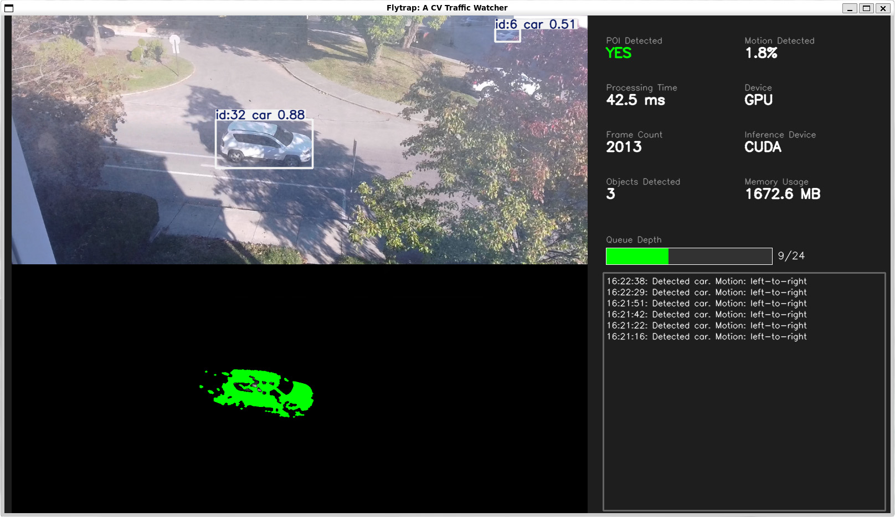

# Flytrap - Real-time Object Detection with SRT Streams

Real-time object detection and tracking using YOLO11 with SRT (Secure Reliable Transport) video streams. Tracks vehicles, people, and bicycles with direction detection, speed calculation, and automatic screenshot capture. Includes comprehensive time-series metrics storage with InfluxDB and Grafana visualization.

## ✨ Features

- **Multi-method SRT streaming** with automatic fallback (GStreamer → OpenCV → FFmpeg)
- **Real-time YOLO11 detection** with built-in object tracking
- **Motion-based inference** to skip processing when no movement detected
- **Direction detection** (left-to-right/right-to-left) with midpoint crossing
- **Speed calculation** in mph based on configurable road width
- **Automatic screenshots** for right-to-left movement with annotations
- **Region of Interest (ROI)** support to focus on road areas
- **Memory management** with aggressive cleanup and leak detection
- **Hardware acceleration** (CUDA/MPS/CPU) with auto-detection
- **Headless mode** auto-detection for WSL/SSH environments
- **Comprehensive metrics** stored in InfluxDB with Grafana dashboards
- **Configurable detection FPS** for performance tuning

## 🎯 System Overview

The system uses a sophisticated pipeline:

1. **Stream Reception**: SRT stream → GStreamer/OpenCV/FFmpeg fallback
2. **Frame Processing**: Motion detection → YOLO inference → Tracking
3. **Analytics**: Direction/speed calculation → Screenshot capture
4. **Storage**: File logging + InfluxDB metrics + Grafana visualization

## 📊 Monitoring & Visualization

- **Grafana Dashboard**: http://localhost:3000 (admin/admin)
- **InfluxDB UI**: http://localhost:8086 (admin/flytrap-admin-password)

## Why "Flytrap?"

**Venus Flytrap** is a character on the CBS television sitcom "[WKRP in Cincinnati](https://en.wikipedia.org/wiki/WKRP_in_Cincinnati)" that ran from 1978-1982, portrayed by actor Tim Reid. He was known for his smooth, laid-back on-air persona and stylish approach as the evening DJ. However, later in the series, the station transitioned to more of a news-focus in order to remain viable. With it, Venus' role shifted to traffic reporting -- and created as more nuanced and central character in the show.

-----

*Flytrap is open source software released under the MIT License.*
