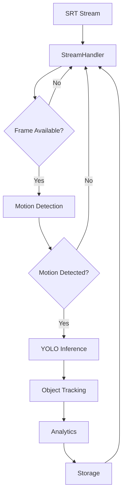

# Architecture Overview

Flytrap uses a sophisticated, modular architecture designed for real-time video processing, object detection, and analytics. This document explains the system design, data flow, and core components.

## System Pipeline

The system processes video streams through a four-stage pipeline:

```
┌─────────────────┐    ┌──────────────────┐    ┌─────────────────┐    ┌─────────────────┐
│  Stream         │ -> │   Frame          │ -> │   Analytics     │ -> │   Storage       │
│  Reception      │    │   Processing     │    │                 │    │                 │
│                 │    │                  │    │                 │    │                 │
│ • SRT Input     │    │ • Motion Detect  │    │ • Direction     │    │ • File Logs     │
│ • Fallback      │    │ • YOLO Inference │    │ • Speed Calc     │    │ • InfluxDB      │
│ • Multi-format  │    │ • Object Track   │    │ • Screenshots    │    │ • Grafana       │
└─────────────────┘    └──────────────────┘    └─────────────────┘    └─────────────────┘
```

### 1. Stream Reception
**Purpose**: Receive and decode video streams from various sources
- **Primary**: SRT (Secure Reliable Transport) protocol
- **Fallbacks**: GStreamer → OpenCV → FFmpeg
- **Output**: Decoded video frames at target FPS

### 2. Frame Processing
**Purpose**: Analyze video frames for objects and motion
- **Motion Detection**: Skip processing when no movement detected
- **YOLO Inference**: Object detection and classification
- **Tracking**: Maintain object identities across frames
- **Output**: Detected objects with bounding boxes and metadata

### 3. Analytics
**Purpose**: Calculate movement patterns and generate insights
- **Direction Detection**: Left-to-right vs right-to-left movement
- **Speed Calculation**: MPH based on road width and timing
- **Screenshot Capture**: Automatic capture for specific events
- **Output**: Enriched detection data with analytics

### 4. Storage
**Purpose**: Persist data for monitoring and analysis
- **File Logging**: Structured logs for detections
- **InfluxDB**: Time-series metrics for dashboards
- **Grafana**: Real-time visualization and alerting
- **Output**: Persistent records and dashboards

## Core Components

### ObjectDetector (`detector.py`)
**Role**: Main orchestrator and entry point

The central coordinator that:
- Initializes all components
- Manages the processing pipeline
- Handles configuration and lifecycle
- Coordinates between stream, processing, and storage layers

```python
class ObjectDetector:
    def __init__(self, srt_uri, model_path='yolo11m.pt', **kwargs):
        self.stream_handler = StreamHandler(srt_uri)
        self.frame_processor = FrameProcessor(model_path)
        self.object_tracker = ObjectTracker()
        self.memory_manager = MemoryManager()
        self.detection_logger = DetectionLogger()
        # ... initialization

    def run(self):
        while self.running:
            frame = self.stream_handler.get_frame()
            detections = self.frame_processor.process(frame)
            tracks = self.object_tracker.update(detections)
            self.detection_logger.log_tracks(tracks)
```

### StreamHandler (`stream_handler.py`)
**Role**: Multi-method video stream reception

Handles video input with intelligent fallback:
- **GStreamer**: Primary SRT streaming with hardware acceleration
- **OpenCV**: Fallback for various formats (RTSP, HTTP, files)
- **FFmpeg**: Ultimate fallback for any supported codec

**Key Features:**
- Automatic format detection
- Frame rate control and synchronization
- Buffer management for smooth playback
- Error recovery and reconnection logic

### FrameProcessor (`frame_processor.py`)
**Role**: Motion detection and YOLO inference

Optimizes processing efficiency:
- **Motion Detection**: Uses frame differencing to skip static scenes
- **YOLO Inference**: Runs object detection on motion-detected frames
- **Batch Processing**: Groups frames for efficient GPU utilization
- **Confidence Filtering**: Applies thresholds to reduce false positives

**Performance Optimizations:**
- Processes every 5th frame (~30 FPS → 6 FPS)
- Skips inference when no motion detected
- Maintains processing queue for load balancing

### ObjectTracker (`object_tracker.py`)
**Role**: Object tracking and analytics

Maintains object identities across frames:
- **YOLO Tracking**: Built-in tracking with re-identification
- **Direction Detection**: Monitors movement vectors
- **Speed Calculation**: Computes velocity based on position changes
- **Event Detection**: Triggers screenshots for specific conditions

**Analytics Features:**
- Track lifetime management
- Direction classification (left-to-right, right-to-left)
- Speed calculation using configurable road width
- Automatic screenshot capture for violations/events

### MemoryManager (`memory_manager.py`)
**Role**: Memory cleanup and leak prevention

Critical for long-running applications:
- **Aggressive Cleanup**: Frees unused objects every 20 frames
- **Leak Detection**: Monitors memory usage patterns
- **GPU Memory**: Clears CUDA cache when needed
- **Reference Tracking**: Prevents circular references

### DetectionLogger (`influx_client.py`)
**Role**: Metrics collection and storage

Handles time-series data persistence:
- **InfluxDB Client**: Efficient batch writes
- **Metric Types**: Frame metrics, detection data, system stats
- **Error Handling**: Graceful degradation if database unavailable
- **Performance**: Batched operations for efficiency

### GUIDashboard (`gui_dashboard.py`)
**Role**: Real-time visualization

Provides immediate feedback:
- **Live Preview**: Shows processed video with annotations
- **Detection Overlay**: Bounding boxes and tracking IDs
- **Performance Metrics**: FPS, memory usage, queue depth
- **Headless Detection**: Auto-detects environment and adapts

## Data Flow

### Frame Processing Flow



### Data Structures

#### Detection Data
```python
@dataclass
class Detection:
    bbox: tuple[int, int, int, int]  # x1, y1, x2, y2
    confidence: float
    class_id: int
    class_name: str
    track_id: Optional[int] = None
```

#### Track Data
```python
@dataclass
class Track:
    track_id: int
    class_name: str
    bbox: tuple[int, int, int, int]
    confidence: float
    direction: str  # 'left-to-right', 'right-to-left', 'unknown'
    speed_mph: Optional[float] = None
    screenshot_path: Optional[str] = None
```

## Performance Characteristics

### Throughput Optimization
- **Frame Skipping**: Processes ~6 FPS from 30 FPS input
- **Motion Gating**: Reduces inference by 60-80% in static scenes
- **Batch Processing**: Groups operations for GPU efficiency
- **Queue Management**: Prevents memory overflow

### Memory Management
- **Automatic Cleanup**: Every 20 frames
- **Reference Counting**: Prevents leaks
- **GPU Memory**: Monitored and cleared
- **Buffer Limits**: Configurable queue sizes

### Scalability Considerations
- **Multi-threading**: Separate threads for I/O and processing
- **Async Operations**: Non-blocking database writes
- **Resource Pooling**: Connection reuse for external services
- **Configurable Limits**: Adjustable based on hardware

## Configuration Architecture

### Environment Variables
```bash
# InfluxDB Configuration
INFLUXDB_URL=http://localhost:8086
INFLUXDB_TOKEN=flytrap-super-secret-token-change-in-production
INFLUXDB_ORG=flytrap
INFLUXDB_BUCKET=detections
```

### Runtime Parameters
```python
detector = ObjectDetector(
    srt_uri="srt://192.168.1.100:4201",  # Stream source
    model_path='yolo11m.pt',             # YOLO model
    confidence=0.4,                      # Detection threshold
    road_width_feet=52,                  # Speed calculation
    detection_fps=6.0,                   # Processing rate
    roi_box=(0, 200, 1920, 1030),       # Region of interest
    enable_influx=True,                  # Metrics storage
    headless=False                       # GUI mode
)
```

## Error Handling & Resilience

### Fallback Mechanisms
- **Stream Fallbacks**: GStreamer → OpenCV → FFmpeg
- **Model Fallbacks**: GPU → CPU processing
- **Storage Fallbacks**: InfluxDB → File logging only

### Recovery Strategies
- **Automatic Reconnection**: Network interruptions
- **Graceful Degradation**: Reduced functionality when components fail
- **Error Logging**: Comprehensive error tracking
- **Health Checks**: Component status monitoring

## Extensibility

### Plugin Architecture
The modular design allows for easy extension:
- **Custom Stream Sources**: Add new input formats
- **Alternative Models**: Integrate different detection models
- **Additional Analytics**: Extend tracking capabilities
- **Custom Storage**: Support additional databases/backends

### API Design
Clean interfaces enable component replacement:
- **Stream Interface**: Abstract video input
- **Processor Interface**: Pluggable inference engines
- **Storage Interface**: Flexible data persistence
- **Analytics Interface**: Extensible analysis pipeline

This architecture provides a robust, scalable foundation for real-time video analytics while maintaining flexibility for future enhancements.